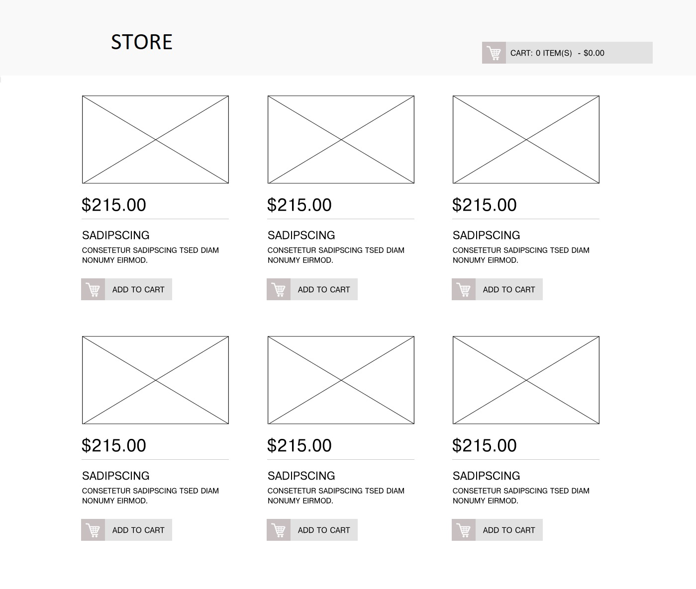

# Desenvolvedor Front-End Jr

## Teste-Dev-Vtex-Jr
Este projeto é a realização de um teste proposto numa vaga de emprego, com o objetivo de medir meus conhecimentos básicos no manuseio do HTML, CSS e ReactJS.
A imagem obtida como referência é esta:

## Execução:
Por ser um projeto react, para testa-lo basta utilizar no Terminal o código `npm start`.
Assim, o projeto abrirá uma página no seu navegador padrão, na porta 3000, onde poderá então testar e manusear o projeto em execução.

## Página Aberta
Com o projeto iniciado e rodando em seu navegador, teremos a página de catálogo, responsável por percorrer nosso arquivo JSON e imprimir na tela os itens em estoque!

#### Nota: Infelizmente algumas imagens estavam quebradas pois foram deletadas do local em que foram hospedadas.
Ao visualizar cada item do catálogo, é perceptível a imagem, preço antigo (nem todos), preço, nome, descrição, desconto(nem todos), e um botão que será responsável por incrementar no nosso carrinho (localizado no canto superior direito da tela) a quantidade de itens escolhidos e o valor total do carrinho.

## Funcionamento
Como utilizei o React, para lidar com a atualização do carrinho, importei o compopnente `UseState`, que me possibilita salvar e manusear dinamicamente os valores de uma variável, com isso, pude realizar os cálculos e incrementos de valor enquanto imprimia na tela o resultado final.
